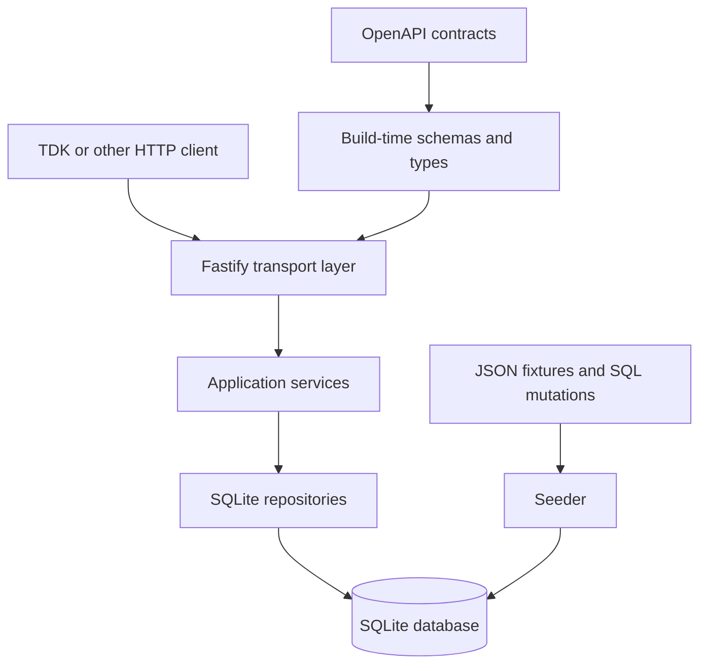

# Mock Portfolio API — System Architecture and Implementation Design

Status: Accepted design slice, implementation-ready  
Runtime: Node.js 24, TypeScript, Fastify, built-in `node:sqlite`  
Contract: `openapi/portfolio-api.yaml` and `openapi/operational-api.yaml`

## 1. Purpose

This document defines the implementation architecture for the mock Portfolio API. The service is intended to be a reusable system under test for the PPM API Test Development Kit (TDK), not merely a presentation prop. It must behave like a small production API, run fully offline on Windows and in Linux containers, and make both valid and intentionally invalid source data observable to API consumers.

The architecture deliberately separates four concerns:

1. The OpenAPI files define the public contract.
2. Fastify validates incoming HTTP requests and handles transport concerns.
3. Application services implement lifecycle and business rules.
4. SQLite and fixture profiles control the data returned by the API, including adverse test data.

The API has no knowledge of the TDK or any other consumer.

## 2. Goals and non-goals

### Goals

- Implement every operation in the accepted OpenAPI surface.
- Produce deterministic behavior suitable for automated tests.
- Load all business data from SQLite rather than hard-coding scenarios in route handlers.
- Preserve missing, malformed, duplicated, and inconsistent stored data in query responses where practical.
- Apply strict request and business validation to API writes without using the database as the first line of defense.
- Support isolated, temporary databases created by Vitest.
- Run without network access after installation or image construction.
- Use a small dependency set and Node.js 24's built-in SQLite driver.

### Non-goals

- OIDC, ADFS, authorization, or identity-provider simulation.
- Pagination or client-selectable sorting.
- Consumer-specific behavior or TDK orchestration.
- Runtime fault-injection endpoints.
- Knowledge-graph integration.
- High-throughput or distributed deployment.
- Automatically correcting adverse fixture data.

## 3. System context



The runtime service never reads fixture JSON and never selects a fixture profile. The seeder creates a database before the server starts. This keeps scenario selection outside the API and ensures that a missing portfolio is genuinely absent from the service's data source.

## 4. Architectural decisions

| Decision | Implementation consequence |
|---|---|
| OpenAPI is the external source of truth | Request schemas and public TypeScript types are generated from the accepted YAML contracts during the build. |
| Request validation belongs at the HTTP boundary | Fastify receives schemas for request bodies, path parameters, and query parameters. Invalid input is rejected before application services run. |
| Business responses must remain observable | Business routes do **not** configure Fastify `schema.response` entries or custom schema-based response serializers. |
| SQLite is the runtime data source | Query and write operations use repositories backed by `DatabaseSync`; no business response is embedded in route code. |
| The database is deliberately permissive | Application services enforce write validity. Existing malformed database values remain available for negative response-contract tests. |
| Handlers remain thin | Route handlers translate HTTP input, call one application operation, and translate the result or error. |
| Time and identifiers are injectable | Tests can supply a fixed clock and deterministic identifier allocation. |
| Sorting is fixed by the API | Every collection query contains an explicit, non-parameterized `ORDER BY` clause. |

### 4.1 Why response schemas are not attached to business routes

Fastify uses `fast-json-stringify` when a response schema is configured. Only fields described by that schema may be serialized. This is valuable for normal production services, but unsuitable here: it could remove unexpected fields, coerce output, or otherwise prevent the TDK from observing the exact adverse record stored in SQLite.

Accordingly:

- Fastify validates requests.
- Ordinary JSON serialization is used for business responses.
- Baseline responses are checked against OpenAPI in automated contract tests.
- Adverse-profile tests prove that expected response violations survive the entire HTTP path.
- Operational endpoints may use response schemas because they never expose adverse business data.

This design follows Fastify's documented distinction between validation and response serialization: [Fastify validation and serialization](https://fastify.io/docs/latest/Reference/Validation-and-Serialization/) — https://fastify.io/docs/latest/Reference/Validation-and-Serialization/

## 5. Recommended project structure

```text
src/
  app.ts
  server.ts
  config/
    runtime-config.ts
  generated/
    openapi-types.ts
    request-schemas.ts
  routes/
    portfolio-routes.ts
    position-routes.ts
    transaction-routes.ts
    strategy-routes.ts
    performance-routes.ts
    allocation-order-routes.ts
    operational-routes.ts
  application/
    portfolio-service.ts
    position-query-service.ts
    transaction-query-service.ts
    strategy-query-service.ts
    performance-query-service.ts
    allocation-order-service.ts
  domain/
    allocation-validation.ts
    errors.ts
    identifiers.ts
    money-and-quantity.ts
    types.ts
  infrastructure/
    sqlite/
      database.ts
      transaction.ts
      portfolio-repository.ts
      position-repository.ts
      transaction-repository.ts
      strategy-repository.ts
      performance-repository.ts
      allocation-order-repository.ts
      reference-data-repository.ts
  presentation/
    problem-details.ts
    response-mappers.ts
  time/
    clock.ts
scripts/
  build-request-schemas.ts
  create-database.ts
  seed-database.ts
  validate-fixtures.ts
test/
  unit/
  integration/
  contract/
  adverse/
```

`app.ts` constructs a Fastify instance from injected dependencies and does not listen on a port. `server.ts` is the production entry point that loads configuration, constructs dependencies, and listens. This split allows Vitest to exercise the complete HTTP stack with Fastify injection and no real socket.

## 6. OpenAPI build pipeline

The two OpenAPI 3.0.3 documents remain human-reviewable canonical contracts. A build script performs these steps:

1. Parse and structurally validate both YAML files.
2. Resolve their local component references.
3. extract request-body, path-parameter, and query-parameter schemas used by each operation;
4. generate a trusted request-schema module compatible with Fastify's JSON Schema support;
5. generate public TypeScript request and response types;
6. fail if an unsupported OpenAPI schema feature is encountered; and
7. emit deterministic files under `src/generated`.

Generated files contain a banner identifying the source file and build command. They are never edited manually. CI regenerates them and fails when the working tree would change, preventing drift between YAML and code.

Fastify v5 uses Ajv 8 for request validation and expects complete JSON Schema objects for route schemas. OpenAPI-specific constructs must therefore be normalized at build time rather than handed to Fastify unchanged. The source contracts intentionally use a conservative OpenAPI 3.0 schema subset. See [Fastify type providers](https://fastify.io/docs/latest/Reference/Type-Providers/) — https://fastify.io/docs/latest/Reference/Type-Providers/

Only trusted repository-owned schemas are compiled. Fastify documents that validation and serialization compilation uses dynamic code generation and therefore schemas must be treated as application code, not user input.

## 7. Runtime composition and startup

Startup is fail-fast and has no hidden data mutation.

1. Load and validate environment configuration.
2. Confirm the configured database file exists before opening it.
3. Open it with `DatabaseSync` in read/write mode.
4. Disable loadable SQLite extensions and enable defensive mode.
5. Keep foreign-key enforcement disabled because the accepted schema intentionally permits broken references.
6. Configure a bounded busy timeout.
7. verify both `PRAGMA user_version` and `schema_metadata` report schema version `1`;
8. construct repositories, the clock, application services, and route plugins;
9. register the global error handler and routes; and
10. begin listening only after the readiness check succeeds.

The API does not create, migrate, seed, repair, or select a profile for a database at startup. Those are explicit preparation commands. `DatabaseSync` is synchronous, which is acceptable for this small deterministic mock and avoids an unnecessary native dependency. The Node.js 24 API is documented at [Node.js `node:sqlite`](https://nodejs.org/download/release/latest-v24.x/docs/api/sqlite.html) — https://nodejs.org/download/release/latest-v24.x/docs/api/sqlite.html

On shutdown, the server stops accepting requests, waits for Fastify to close, and then closes the database. `SIGTERM` and `SIGINT` use the same idempotent shutdown path.

## 8. Configuration

| Environment variable | Required | Default | Meaning |
|---|---:|---|---|
| `MOCK_API_DATABASE_PATH` | Yes | — | Existing SQLite database file to open. |
| `MOCK_API_HOST` | No | `0.0.0.0` | Listening address. |
| `MOCK_API_PORT` | No | `3000` | Listening port, integer from 1 to 65535. |
| `MOCK_API_FIXED_TIME` | No | — | Strict RFC 3339 timestamp used by the fixed clock. |
| `MOCK_API_LOG_LEVEL` | No | `info` | Fastify/Pino log level. |
| `MOCK_API_BODY_LIMIT_BYTES` | No | `1048576` | Maximum parsed request-body size. |

Unknown variables are ignored. Invalid known values cause startup failure with a concise diagnostic that does not expose record data.

The seeding CLI separately accepts an input fixture directory, one profile name, an explicit output database path, and an optional fixed timestamp. It refuses to overwrite an existing output file unless the caller provides an explicit replace flag.

## 9. HTTP request pipeline

For business routes, processing occurs in this order:

1. Fastify parses JSON and enforces the body limit.
2. Content type and route request schemas are validated.
3. The route handler calls exactly one application service method.
4. The application service loads required records and reference data.
5. Business validation runs in the documented order and accumulates safe, client-actionable violations where appropriate.
6. A write transaction executes, or a query result is mapped.
7. The route returns a plain JavaScript value for normal JSON serialization.

Malformed JSON and request-schema violations return `400`. Unsupported media types return `415`. Expected domain failures are mapped to their documented status and stable error code. Unexpected failures return the generic `500` Problem Details response and log the internal cause with the request identifier.

The global error handler emits `application/problem+json` using the accepted RFC 9457 shape. Validation details never include SQL text, stack traces, filesystem paths, or database values unrelated to the submitted request.

## 10. Repository design

Repositories expose operation-oriented methods rather than a generic SQL abstraction. SQL is owned by the repository that understands the result shape. All user-supplied values use prepared-statement parameters.

Dynamic `IN` filters generate only the correct number of `?` placeholders; values are still bound separately. Empty arrays are handled explicitly according to the request contract and never produce invalid SQL.

Every collection statement contains its accepted fixed sort order. No result relies on insertion order, rowid order, or an unordered query plan.

### 10.1 Cardinality rules

The permissive database can contain duplicate public identifiers, broken references, or missing master data. Repositories and mappers use the following rules:

| Observed cardinality | Behavior |
|---|---|
| Exactly one requested resource | Return it. |
| No requested resource | Return the documented `404` result. |
| More than one requested resource with the same public ID | Fail with generic `500 INTERNAL_SERVER_ERROR`; log an ambiguous-source diagnostic. |
| Exactly one related master record | Include its nested summary. |
| No related master record | Retain the top-level reference ID and omit the nested summary. |
| More than one related master record | Fail with generic `500 INTERNAL_SERVER_ERROR`; never choose an arbitrary row. |

Query repositories first load base rows. They then batch-load related portfolios, instruments, and strategies into maps keyed by public identifier. Building a map checks for duplicates. This avoids row multiplication from permissive joins and makes missing or ambiguous reference behavior explicit.

### 10.2 SQLite boundaries

Application services do not receive raw database rows. Repositories return stored-data records whose fields may still contain `null`, wrong scalar types, or malformed values. Response mappers preserve those defects according to the rules in Section 12.

No repository assumes that a declared identifier is unique merely because production data normally would be. No read path silently applies `LIMIT 1` to conceal ambiguity.

## 11. Allocation-order write workflows

All multi-statement writes run inside a reusable `BEGIN IMMEDIATE` transaction helper. It commits on success and rolls back on every thrown error. Nested transactions are prohibited.

### 11.1 Create

1. Request-schema validation succeeds.
2. Load the referenced portfolio, instruments, and strategies.
3. Run business validation in the documented order.
4. Check `clientOrderReference` uniqueness within the portfolio.
5. Read and increment the allocation-order sequence inside the transaction.
6. Format the public ID as `AORD-` plus the configured zero-padded sequence value.
7. Confirm the generated public ID is not already present.
8. Insert the header and allocation rows.
9. Read back and enrich the stored order for the `201` response.

A sequence collision is an internal consistency failure. The API rolls back and returns generic `500`; it does not silently skip identifiers.

### 11.2 Replace draft order

1. Load the order and enforce the cardinality rules.
2. Require status `DRAFT`.
3. Validate the complete replacement request and all references.
4. Check client-reference uniqueness while excluding the current order.
5. Update the header, delete existing allocations, and insert replacements within one transaction.
6. Read back and enrich the resulting order.

The operation is a complete replacement of editable request fields, not a patch.

### 11.3 Submit

Submitting requires `DRAFT`. The service revalidates the currently stored order, including its stored references and allocations, before changing status to `SUBMITTED`. This means a database altered after creation can cause submission to fail through documented validation errors. The deliberately omitted aggregate-allocation rule is not applied in the baseline implementation.

### 11.4 Cancel

Cancellation is allowed from `DRAFT` or `SUBMITTED` and changes status to `CANCELLED`. It does not revalidate allocation content, because cancellation must remain possible for an otherwise invalid stored order. Cancelling an already cancelled order returns the accepted `409 Conflict` response.

## 12. Response mapping and defect preservation

The response mapper converts storage-oriented records into the documented nesting structure without acting as a repair layer.

For known-good write inputs, quantities are canonicalized to exactly four decimal places and percentages to exactly two decimal places before storage. Timestamps come from the injected clock and are stored as UTC RFC 3339 values.

For records loaded from existing fixtures:

- a non-null stored scalar is returned without truthiness-based defaulting;
- a required field stored as `NULL` is emitted as JSON `null` rather than being invented or omitted;
- an optional field stored as `NULL` is omitted;
- a missing related master causes the nested summary to be omitted while the original reference ID remains;
- a wrong stored scalar type remains the wrong JSON scalar type;
- unknown database columns are not exposed merely because they exist; and
- no response is validated, stripped, coerced, or normalized at runtime.

This boundary intentionally preserves contract violations that originate in accepted fixture profiles while preventing unrelated storage metadata from leaking into the API.

## 13. Time and identifier determinism

Application services depend on a small `Clock` interface. `SystemClock` returns the current time. `FixedClock` parses `MOCK_API_FIXED_TIME` once at startup, normalizes it to UTC, and returns the same instant for every call. An invalid or ambiguous timestamp prevents startup.

Identifiers are allocated by the database sequence inside the same transaction as the new order. Tests obtain repeatability by starting from a freshly seeded temporary database, not by installing a process-global mock.

## 14. Operational endpoints

`GET /health` reports whether the Node.js process and Fastify event loop can serve requests. It does not access SQLite.

`GET /ready` executes a trivial SQLite statement and verifies the two expected schema-version markers. It returns a non-ready status if the database is unavailable, closed, busy beyond the configured timeout, or has the wrong version.

Operational responses contain no fixture content. They may use Fastify response schemas because preserving malformed business data is irrelevant to them.

## 15. Logging and diagnostics

Every request receives or reuses a request identifier and includes it in logs and Problem Details where the accepted contract allows. Normal completion logs contain method, route template, status, and elapsed time.

Internal diagnostics may include public record identifiers and SQLite error codes. They must not log complete request bodies, allocation arrays, account data, raw SQL parameters, filesystem content, or stack traces at normal log levels. Full stack traces are limited to development logging.

## 16. Container and offline execution

The distributable container uses a multi-stage build based on Node.js 24. Dependencies are installed from the lockfile during image construction; the runtime image requires no network access. The final stage contains compiled JavaScript, production dependencies, OpenAPI files, schema SQL, fixture assets needed by explicit tooling, and a non-root runtime user.

The database path is mounted beneath a writable data directory. Application code and fixtures remain read-only. The container exposes the configured port, handles `SIGTERM`, and uses `/ready` for its health check.

No Swagger UI assets, fonts, schemas, or scripts are loaded from a CDN. If API documentation is served later, it must be packaged locally. Image tags should be pinned to a Node.js 24 patch version and immutable digest when the implementation is released.

## 17. Dependency policy

The runtime dependency set should remain minimal:

- `fastify` for HTTP transport, routing, request validation, logging integration, and lifecycle;
- Node.js built-ins for SQLite, filesystem access, paths, signals, and clocks.

Development dependencies may include TypeScript, Vitest, a YAML parser, an OpenAPI validator/type generator, and an independent JSON Schema validator with format support for contract tests. Exact packages and versions are selected and locked in the implementation slice. Native SQLite add-ons, especially `better-sqlite3`, are excluded.

## 18. Verification strategy

| Test layer | Required evidence |
|---|---|
| Unit | Business rules, state transitions, decimal canonicalization, clock parsing, error mapping. |
| Repository integration | Real temporary SQLite databases, fixed sorting, filters, duplicate-ID handling, missing reference behavior, transaction rollback. |
| Baseline API contract | Every success and documented error example validates against the OpenAPI contract. |
| Adverse API contract | Each declared adverse issue is observable in the HTTP response and detected by the independent contract validator. |
| Lifecycle | Create, get, replace, submit, and cancel behavior, including all accepted `409` cases. |
| Fixture | Baseline and adverse profiles reproduce their manifests exactly from a clean database. |
| Container | Startup, readiness, graceful stop, non-root execution, writable mounted database, and operation with outbound networking disabled. |

Contract tests must validate the serialized HTTP payload, not the in-memory object returned by a mapper. This proves that the complete transport stack preserves the intended defect.

## 19. Error and consistency policy

Expected client and domain failures use the stable Problem Details codes already defined in OpenAPI. Repository ambiguity, sequence collisions, schema-version disagreement, and unexpected SQLite failures are internal consistency problems. They produce the generic documented `500` response while retaining detailed diagnostics in logs.

The API never guesses when permissive data creates ambiguity. It also never broadens a successful response merely to expose arbitrary database columns. The target behavior is transparent, deterministic imperfection—not undefined behavior.

## 20. Deferred decisions

The following are intentionally deferred until they are needed:

- serving a bundled interactive API documentation page;
- an administrative fixture/profile endpoint;
- configurable artificial latency or transport failures;
- pagination;
- authentication and authorization;
- knowledge-graph integration;
- load-test targets; and
- the aggregate-allocation-total validation rule, which remains the planned follow-up requirement change.

## 21. Implementation acceptance checklist

Implementation is ready for handoff when all of the following are true:

- both OpenAPI files pass structural validation;
- generated request schemas and TypeScript types are reproducible;
- every documented route is implemented;
- request validation produces the accepted Problem Details format;
- no business route has a response schema or schema-driven serializer;
- baseline response contract tests pass;
- adverse profiles yield exactly their declared detectable issues;
- application writes reject invalid input before persistence;
- create and replace operations roll back completely on failure;
- fixed sorting, fixed time, and sequence behavior are deterministic;
- duplicate public identifiers never yield an arbitrary result;
- `/health` and `/ready` reflect their distinct responsibilities;
- the service passes Node.js 24 tests on Windows and Linux; and
- the production container runs offline as a non-root user.

## 22. Next design artifact

The next slice is the OpenSpec package: an archived baseline capability specification plus an active change proposal that introduces the deliberately absent rule requiring allocation percentages to total exactly `100.00`. That package will convert the accepted requirements into scenario-oriented specifications before implementation begins.
